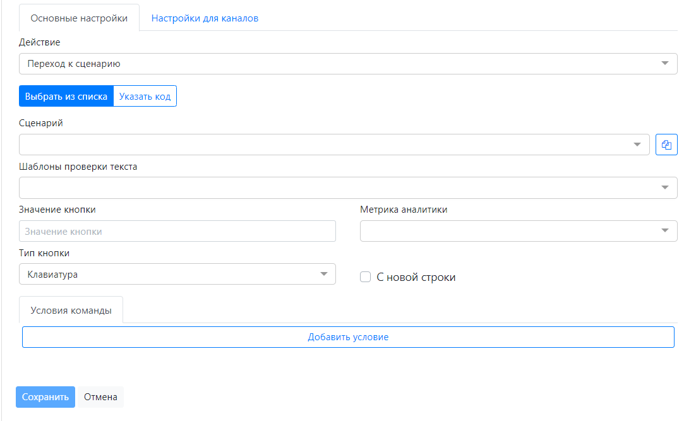

import { TabView, TabPanel } from 'primereact/tabview';
import Tabs from '@theme/Tabs';
import TabItem from '@theme/TabItem';
import Mermaid from '@theme/Mermaid';

# Команда кнопка
Команда, отправляющая кнопку в мессенджер. Ниже приведены документация пользователя и практический видео урок по команде Кнопка, подробно описывающая все реквизиты карточки команды Кнопка. 
## Документация пользователя по команде кнопка

Дополнительные поля команды Кнопка:
| Поля   | Описание |
|:--------|:-------:|
| Заголовок | Кроме имени команды используется в качестве имени кнопки в мессенджере.|
| Действие  | Действие кнопки. Определяет механику работы команды (см. ниже).|
| Тип кнопки    | Форма отображения кнопки. Работает в зависимости от канала (ВКонтакте, Telegram и т.д.)
— **В тексте** – кнопка отражается в тексте сообщения.
— **Клавиатура** – копка отражается как дополнительная клавиатура.
— **Команда** – поддерживается Telegram и задает действие, вызываемое
вводом текста /command.|
| С новой строки	| Определят расположение кнопок в мессенджере. Позволяет группировать кнопки для отражения в одной строке. Кнопка с признаком `[С новой строки]`=Да отражается на новой строке.|
| Метрика аналитики	| Метрика аналитики, определенная для сценария. Используется для анализа статистики вызова конкретных сценариев в отчетах.|
| Значение кнопки	|  Позволяет различить нажатую кнопку в случае вызова одного сценария по нескольким кнопкам. Значение нажатой кнопке сохраняется при переходе к сценарию в переменную контекста бота с именем `#ChatButtons_Value#`|
